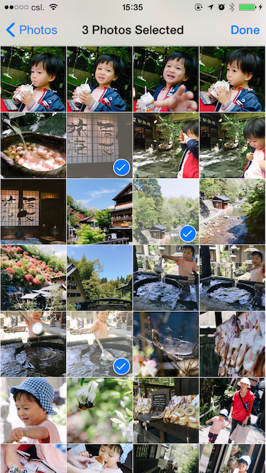

# CTAssetsPickerController

CTAssetsPickerController v2 released! It has newly re-design delegate methods, fixed serveral issues and improved usability. Please see [What's new](#whats-new) for the details.

## Introduction

CTAssetsPickerController is an iOS controller that allows picking multiple photos and videos from user's photo library. The usage and look-and-feel are just similar to UIImagePickerController. It uses **ARC**. Requires **AssetsLibrary** and **MediaPlayer** frameworks.



## Features
1. Picks multiple photos and videos across albums from user's library.
2. Previews assets by long-press gesture.
3. Filters assets for picking only photos or videos.
4. Filters assets or albums by their properties.
5. Achieves average 5x fps.
6. Conforms UIAccessibility Protocol.
7. Support iPhone 6 and iPhone 6 Plus native view.


## What's new
* [Release Notes](RELEASE-NOTES.md)

#### Note
CTAssetsPickerController has dropped support for iOS 6. To use this control with iOS 6, you might consider to checkout the obsolete branch [1.x.x](https://github.com/chiunam/CTAssetsPickerController/tree/1.x.x), which developement has been ceased.


## Minimum Requirement
Xcode 5 and iOS 7.

## Installation

### via [CocoaPods](http://cocoapods.org)

````bash
$ edit Podfile
platform :ios, '7.0'
pod 'CTAssetsPickerController',  '~> 2.6.0'
$ pod install
````
* Use the Xcode workspace instead of the project.

### via Git Submodules

````bash
$ git submodule add http://github.com/chiunam/CTAssetsPickerController
````
1. Drag `CTAssetsPickerController` folder in your project and add to your targets.
2. Add `AssetsLibrary.framework` and `MediaPlayer.framework`.

## Simple Uses

See the demo project and [documentation](#documentation) for the details.

### Import header

```` objective-c
#import <CTAssetsPickerController.h>
````

### Create and present CTAssetsPickerController

```` objective-c
CTAssetsPickerController *picker = [[CTAssetsPickerController alloc] init];
picker.delegate = self;
[self presentViewController:picker animated:YES completion:nil];
````

### Implement didFinishPickingAssets delegate

The delegate is responsible for dismissing the picker when the operation completes. To dismiss the picker, call the [dismissViewControllerAnimated:completion:](https://developer.apple.com/library/ios/documentation/uikit/reference/UIViewController_Class/Reference/Reference.html#//apple_ref/occ/instm/UIViewController/dismissViewControllerAnimated:completion:) method of the presenting controller responsible for displaying `CTAssetsPickerController` object. Please refer to the demo app.

```` objective-c
- (void)assetsPickerController:(CTAssetsPickerController *)picker didFinishPickingAssets:(NSArray *)assets;
// assets contains ALAsset objects.
````

## Customization

Customization can be done by setting properties or implementating delegate methods. This section describes common customizations. Please refer to the [documentation](#documentation) for the complete list of properties and delegate methods.

### Properties

**Filter picker contents**

Pick only photos or videos by creating an `ALAssetsFilter` and assigning it to `assetsFilter`. If you need filtering by assets' properties, implement `shouldShowAsset` [delegate method](#delegate-methods).
```` objective-c
picker.assetsFilter = [ALAssetsFilter allPhotos]; // Only pick photos.
````

**Hide cancel button**

Hide cancel button if you present the picker in `UIPopoverController`.
```` objective-c
picker.showsCancelButton = NO;
````

**Hide number of assets**

Hide number of assets if you implement `shouldShowAsset` delegate method.
```` objective-c
picker.showsNumberOfAssets = NO;
````

**Override picker's title**

Override title of the albums selection screen.
```` objective-c
picker.title = @"Pick photos";
````

**Set initially selected assets**

Set selected assets by assigning an `NSMutableArray` to `selectedAssets`.
```` objective-c
picker.selectedAssets = [NSMutableArray arrayWithArray:@[asset1, asset2, asset3, ...]];
````

### Delegate Methods

**Set maximum number of selections**

Limit the number of assets to be picked.
```` objective-c
- (BOOL)assetsPickerController:(CTAssetsPickerController *)picker shouldSelectAsset:(ALAsset *)asset
{
    // Allow 10 assets to be picked
    return (picker.selectedAssets.count < 10);
}
````

**Hide assets**

Show only certain assets.
```` objective-c
- (BOOL)assetsPickerController:(CTAssetsPickerController *)picker shouldShowAsset:(ALAsset *)asset
{
    // Show only assets with 640px width
    return (asset.defaultRepresentation.dimensions.width == 640);
}
````

**Disable assets**

Enable only certain assets to be selected.
```` objective-c
- (BOOL)assetsPickerController:(CTAssetsPickerController *)picker shouldEnableAsset:(ALAsset *)asset
{
    // Enable video clips if they are at least 5s
    if ([[asset valueForProperty:ALAssetPropertyType] isEqual:ALAssetTypeVideo])
    {
        NSTimeInterval duration = [[asset valueForProperty:ALAssetPropertyDuration] doubleValue];
        return lround(duration) >= 5;
    }
    // Photos are always enabled
    else
    {
        return YES;
    }
}
````

**Default album**

You can show an album content (e.g. Camera Roll) initially instead of a list of albums by implementing the following delegate method. The default album must not returns `NO` in `shouldShowAssetsGroup`. 
```` objective-c
- (BOOL)assetsPickerController:(CTAssetsPickerController *)picker isDefaultAssetsGroup:(ALAssetsGroup *)group
{
    // Set Camera Roll as default album and it will be shown initially.
    return ([[group valueForProperty:ALAssetsGroupPropertyType] integerValue] == ALAssetsGroupSavedPhotos);    
}
````


**Hide albums**

The picker shows all albums by default, including empty albums, iCloud albums and those synced with iTunes. You may hide albums by implementing the following delegate method.
```` objective-c
- (BOOL)assetsPickerController:(CTAssetsPickerController *)picker shouldShowAssetsGroup:(ALAssetsGroup *)group
{
    // Do not show empty albums
    return group.numberOfAssets > 0;
}
````

**Show alert on selection**

Assets stored on iCloud may not be displayed and picked properly if they have not downloaded to the device. You can show an alert when user try to select empty assets

```` objective-c
- (BOOL)assetsPickerController:(CTAssetsPickerController *)picker shouldSelectAsset:(ALAsset *)asset
{
    // Show alert when user try to select assets that have not been downloaded
    if (!asset.defaultRepresentation)
    {
        UIAlertView *alertView =
        [[UIAlertView alloc] initWithTitle:@"Attention"
                                   message:@"Your asset has not yet been downloaded to your device"
                                  delegate:nil
                         cancelButtonTitle:nil
                         otherButtonTitles:@"OK", nil];

        [alertView show];
    }

    return (asset.defaultRepresentation != nil);
}
````

### Apperance

The first child view controller of the picker is a `UINavigationController`. You can access the navigation controller via the property `childNavigationController` and then customise its apperance.

```` objective-c
// Set navigation bar's tint color
picker.childNavigationController.navigationBar.tintColor = ...

// Set navigation bar's title attributes
picker.childNavigationController.navigationBar.titleTextAttributes = ...

````

You may also create custom `UINavigationController` subclass if you want to control things like the status bar. Just subclass `CTAssetsPickerController` and provide your own `UINavigationController` via the function `createChildNavigationController`.

```` objective-c
@interface BaseAssetsPickerController : CTAssetsPickerController 
@end

@implementation BaseAssetsPickerController
- (UINavigationController *)createChildNavigationController
{
    return [BaseChildNavigationController alloc];
}
@end

````


### Notifications

An `NSNotification` object named `CTAssetsPickerSelectedAssetsChangedNotification` will be sent when user select or deselect assets. You may add your observer to monitor the change of selection.

## Bonus

You may reuse the preview feature of the picker to view any assets. Just init a `CTAssetsPageViewController` with an array of assets and assign `pageIndex` property. Please refer to the demo app.

```` objective-c
NSArray *assets = @[asset1, asset2, asset3, ...];
CTAssetsPageViewController *vc = [[CTAssetsPageViewController alloc] initWithAssets:assets];
vc.pageIndex = assets.count - 1; // display the last asset 

[self.navigationController pushViewController:vc animated:YES];
````    


## Documentation
* [Online documentation](http://chiunam.github.io/CTAssetsPickerController)
* If you have [Appledoc](https://github.com/tomaz/appledoc) installed, you can also install the documentation to Xcode by running the `Documentation` target of the demo project.


## Note
CTAssetsPickerController does not compress the picked photos and videos. You can process the picked assets via the `defaultRepresentation` property.

For example, you can create `UIImage` from picked assets like this:-

```` objective-c
ALAssetRepresentation *representation = alAsset.defaultRepresentation;

UIImage *fullResolutionImage =
[UIImage imageWithCGImage:representation.fullResolutionImage
					scale:1.0f
			  orientation:(UIImageOrientation)representation.orientation];
````

and create `NSData` of picked vidoes:-

```` objective-c
ALAssetRepresentation *representation = alAsset.defaultRepresentation;

NSURL *url          = representation.url;
AVAsset *asset      = [AVURLAsset URLAssetWithURL:url options:nil];

AVAssetExportSession *session =
[AVAssetExportSession exportSessionWithAsset:asset presetName:AVAssetExportPresetLowQuality];

session.outputFileType  = AVFileTypeQuickTimeMovie;
session.outputURL       = VIDEO_EXPORTING_URL;

[session exportAsynchronouslyWithCompletionHandler:^{

	if (session.status == AVAssetExportSessionStatusCompleted)
	{
		NSData *data    = [NSData dataWithContentsOfURL:session.outputURL];
	}

}];
````
Please refer the documentation of `ALAssetRepresentation` and `AVAssetExportSession`.


## License

 The MIT License (MIT)

 Copyright (c) 2013 Clement CN Tsang

 Permission is hereby granted, free of charge, to any person obtaining a copy
 of this software and associated documentation files (the "Software"), to deal
 in the Software without restriction, including without limitation the rights
 to use, copy, modify, merge, publish, distribute, sublicense, and/or sell
 copies of the Software, and to permit persons to whom the Software is
 furnished to do so, subject to the following conditions:

 The above copyright notice and this permission notice shall be included in
 all copies or substantial portions of the Software.

 THE SOFTWARE IS PROVIDED "AS IS", WITHOUT WARRANTY OF ANY KIND, EXPRESS OR
 IMPLIED, INCLUDING BUT NOT LIMITED TO THE WARRANTIES OF MERCHANTABILITY,
 FITNESS FOR A PARTICULAR PURPOSE AND NONINFRINGEMENT. IN NO EVENT SHALL THE
 AUTHORS OR COPYRIGHT HOLDERS BE LIABLE FOR ANY CLAIM, DAMAGES OR OTHER
 LIABILITY, WHETHER IN AN ACTION OF CONTRACT, TORT OR OTHERWISE, ARISING FROM,
 OUT OF OR IN CONNECTION WITH THE SOFTWARE OR THE USE OR OTHER DEALINGS IN
 THE SOFTWARE.
